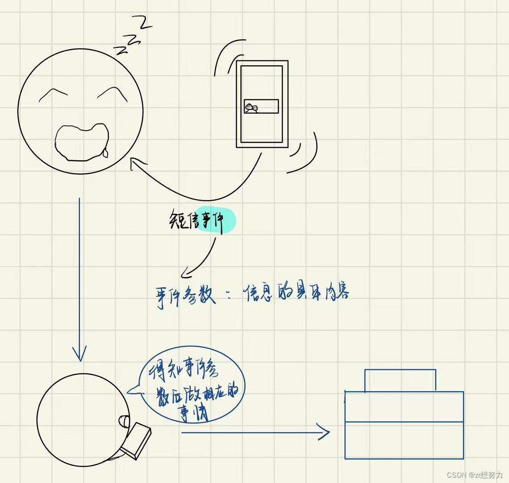
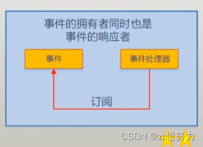
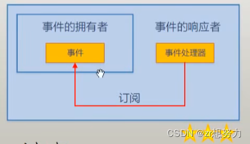

关于 C#事件解析

<!-- more -->

# 一. 什么是事件

## 1. 字面说明

事件(Event): 通俗的解释就是“能够发生的事情”，并且事件都是隶属于某一个主体的，比如公司上市，那个上市这个事件就是隶属于公司。

由上面的定义就可以知道，将事件抽象到代码当中就是，事件要隶属于一个类，也就是一个类的成员。

在前面就已经讲过:

- **属性**：让对象有了访问数据的功能
- **方法**：让对象有了对数据加工的功能
- **事件**：让对象有了通知能力，使对象有了能通风报信的成员

## 2. 举个例子

- **手机**：具备时间的对象
- **人**：接受事件的对象，思考的过程就是事件处理器
  

# 总的来说

根据事件参数来响应事件。

## 原理

事件模型的两个“5”：

- **“发生->响应”的五个部分**：
  - “孩子 饿了 我 做饭”
  - “闹钟 响了 我 上班”

其中的第五个部分存在订阅关系：“这个孩子是由我来响应的”，“这个闹钟是我的”。也就是说由绑定的关系，这样一来就是五个部分了。

- **“发生->响应”的五个动作**：
  1. 有一个事件
  2. 有一群人关注到这个事件
  3. 事情发生了
  4. 关心这个事件的人被通知
  5. 拿到信息的人根据事件参数对事件进行处理

## 小结

事件是用来对象或者类之间的信息传递与动作协调。

**事件 = 事件的通知 + 可选的事件的参数（详细信息）**

## 事件的应用

一个简单的小示例

<pre><code class="csharp">using System;
using System.Timers;
namespace Hanoi
{
 
    class Programme
    {
        static void Main(string[] args)
        {
            Timer timer = new Timer();//事件的发送者
            timer.Interval = 1000;
            Boy boy = new Boy();//事件的响应者
            Gril gril = new Gril();
            timer.Elapsed += gril.Action;
            timer.Elapsed += boy.Action;//事件的订阅
            timer.Start();
            Console.ReadLine();
        }
    }
 
    class Boy
    {
        internal void Action(object sender, ElapsedEventArgs e)//为了保持一致性,这里的定义是visual studio自动生成的
        {
            Console.WriteLine("Jump!!");//事件处理器
        }
    }
 
    class Gril
    {
        internal void Action(object sender, ElapsedEventArgs e)
        {
            Console.WriteLine("Song!");
        }
    }
 
}
</code></pre>

# 类型一:

<pre><code class="csharp">using System;
using System.Windows.Forms;
namespace Hanoi
{
 
    class Programme
    {
        static void Main(string[] args)
        {
            Form form = new Form();
            Recevier rev = new Recevier(form);
            form.ShowDialog();
        }
    }
 
    class Recevier
    {
        private Form form;
        public Recevier(Form from)
        {
            if(from != null) 
            {
                this.form = from;
                this.form.Click += this.FormClicked;
            }
        }
 
        private void FormClicked(object sender, EventArgs e)
        {
            this.form.Text = DateTime.Now.ToString();
        }
    }
   
 
}
</code></pre>

# 类型二:

<pre><code class="csharp">using System;
using System.Windows.Forms;
namespace Hanoi
{
 
    class Programme
    {
        static void Main(string[] args)
        {
           MyForm form = new MyForm();
           form.Click+=form.Action;
            form.ShowDialog();
        }
    }
    class MyForm : Form
    {
        internal void Action(object sender, EventArgs e)
        {
            this.Text = DateTime.Now.ToString();
        }
    }
 
 
}
</code></pre>

# 类型三:

<pre><code class="csharp">using System;
using System.Windows.Forms;
namespace Hanoi
{
 
    class Programme
    {
        static void Main(string[] args)
        {
            MyForm form = new MyForm(); 
            form.ShowDialog();
        }
    }
 
    class MyForm:Form
    {
        private TextBox mytextbox;
        private Button mybutton;
        public MyForm()
        {
            mytextbox = new TextBox();
            mybutton = new Button();
            this.Controls.Add(mytextbox);
            this.Controls.Add(mybutton);
            mybutton.Height = 50;
            mybutton.Left = 100;
            mybutton.Top = 50;
            mytextbox.Left = 100;
            mybutton.Click+=this.Action;
        }
 
        private void Action(object sender, EventArgs e)
        {
            this.mytextbox.Text = "Hello,World";
        }
    }
}
</code></pre>

# 制作自己的事件

## 事件声明的完整格式

可能会有一点点绕，但只要和委托事件结合起来，还是比较容易理解的。

<pre><code class="csharp">using System;
using System.Globalization;
using System.Windows.Forms;
using System.Threading;
namespace Hanoi
{
    class Programme
    {
        static void Main(string[] args)
        {
            Customer customer = new Customer();
            Waiter waiter = new Waiter();
            customer.Order += waiter.Action;//事件连接
            customer.Action();
        }
    }
 
 
    public class OrderArgs
    {
        public string Size { get; set; }
        public string Name { get; set; }
    }
 
    public delegate void OrderHandller(Customer customer, OrderArgs e);
    public class Customer
    {
        public int Bill { get; set; }
        public void PaytheBill()
        {
            Console.WriteLine("I Will pay you {0} dollers", Bill);
        }
        public OrderHandller orderHandller;
        public event OrderHandller Order
        {
            add { orderHandller = value; }
            remove { orderHandller = value; }
        }
        public void Action()
        {
            Console.WriteLine("Walking Into the resturant");
            for(int i=0;i<3;i++)
            {
                Console.WriteLine("da da da");
                Thread.Sleep(1000);
            }
            Console.WriteLine("Thinking .....");
            for(int i=0;i<3;i++)
                Thread.Sleep(1000);
            if(orderHandller != null)//这里是指事件发生了,有没有人响应
            {
                this.orderHandller(this, new OrderArgs() { Name = "Pizza", Size = "large" });
            }
        }
 
    }
    class Waiter
    {
        internal void Action(Customer customer, OrderArgs e)
        {
            switch(e.Size)
            {
                case "large":
                    customer.Bill += 10;
                    break;
                case "small":
                    customer.Bill += 5;
                    break;
                default:
                    break;
            }
            Console.WriteLine("you shoud Pay{0} for the{1}",customer.Bill, e.Name);
            customer.PaytheBill();
        }
    }
 
}
</code></pre>

## 事件声明简化版本

<pre><code class="csharp"> public OrderHandller orderHandller;
 public event OrderHandller Order
 {
     add { orderHandller = value; }
     remove { orderHandller = value; }
 }
 
if(orderHandller!= null)//这里是指事件发生了,有没有人响应
{
    this.orderHandller(this, new OrderArgs() { Name = "Pizza", Size = "large" });
}
 
//将上述代码替换成
 public OrderHandller orderHandller;
public event OrderHandller Order;
 
if(Order != null)//这里是指事件发生了,有没有人响应
{
    this.Order(this, new OrderArgs() { Name = "Pizza", Size = "large" });
}
</code></pre>

## 用 C#自带的事件处理器处理事件

<pre><code class="csharp">using System;
using System.Globalization;
using System.Windows.Forms;
using System.Threading;
namespace Hanoi
{
    class Programme
    {
        static void Main(string[] args)
        {
            Customer customer = new Customer();
            Waiter waiter = new Waiter();
            customer.Order += waiter.Action;//事件连接
            customer.Action();
        }
    }
 
 
    public class OrderArgs:EventArgs
    {
        public string Size { get; set; }
        public string Name { get; set; }
    }
    public class Customer
    {
        public int Bill { get; set; }
        public void PaytheBill()
        {
            Console.WriteLine("I Will pay you {0} dollers", Bill);
        }
        public event EventHandler Order;
        public void Action()
        {
            Console.WriteLine("Walking Into the resturant");
            for(int i=0;i<3;i++)
            {
                Console.WriteLine("da da da");
                Thread.Sleep(1000);
            }
            Console.WriteLine("Thinking .....");
            for(int i=0;i<3;i++)
                Thread.Sleep(1000);
            if(Order != null)//这里是指事件发生了,有没有人响应
            {
                this.Order(this, new OrderArgs() { Name = "Pizza", Size = "large" });
            }
        }
 
    }
    class Waiter
    {
        internal void Action(object customer, EventArgs e)
        {
            Customer cus = customer as Customer;
            OrderArgs args = e as OrderArgs;
            switch(args.Size)
            {
                case "large":
                    cus.Bill += 10;
                    break;
                case "small":
                    cus.Bill += 5;
                    break;
                default:
                    break;
            }
            Console.WriteLine("you shoud Pay{0} for the{1}",cus.Bill, args.Name);
            cus.PaytheBill();
        }
    }
 
}
</code></pre>

事件的书写规范

<pre><code class="csharp">protected void OnOrder(object customer,OrderArgs args)
{
    if (Order != null)//这里是指事件发生了,有没有人响应
    {
        this.Order(customer, new OrderArgs() { Name = "Pizza", Size = "large" });
    }
}
//事件的专属触发器用On+动词命名
</code></pre>

## 小结

通过上述例子也可以得知,事件就是委托类型的包装器,包装器对委托的字段起到了限制的作用,也就是委托的参数只能由事件发起者自己来传递,而不由别人传递
