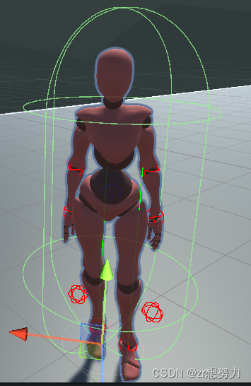
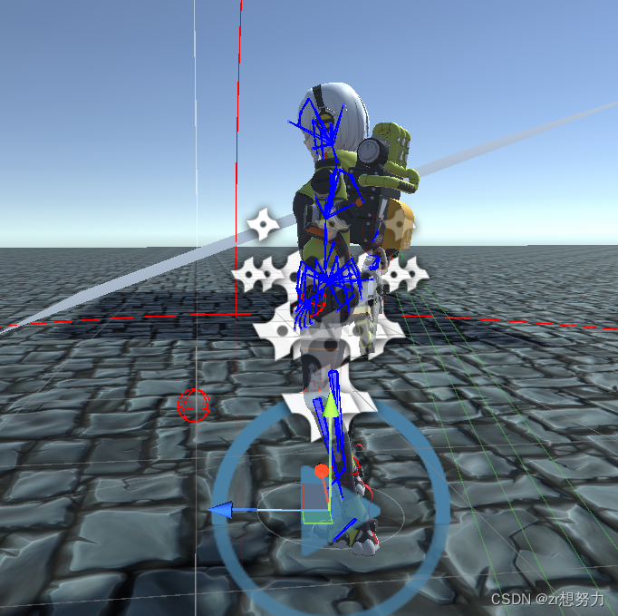
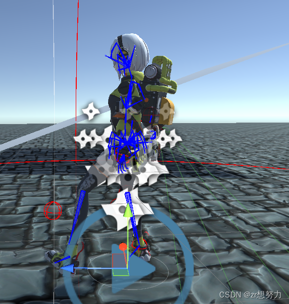
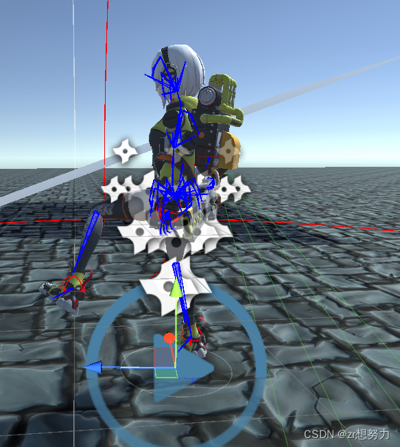
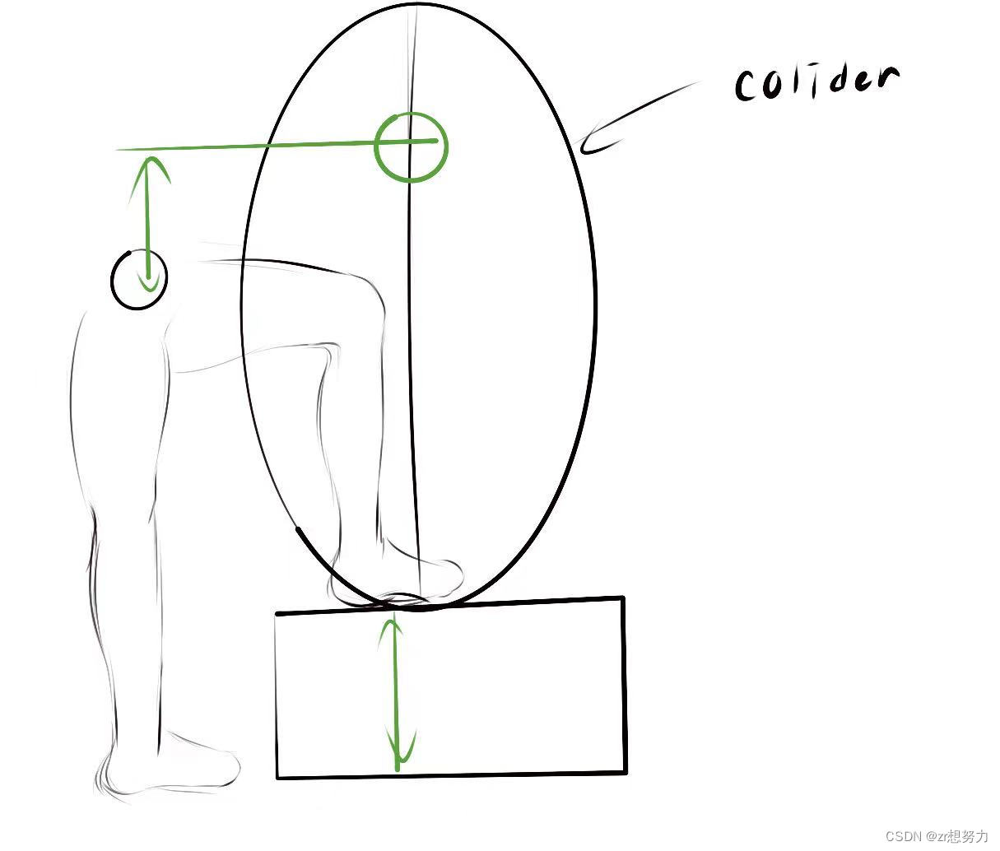

关于 Unity3d 中的反向动力学代码解读

<!-- more -->

# 认识 IK (Inverse Kinematics)

在 Unity3D 中的人物动画中有十个位置的 IK，分别是：

- 头部
- 左右手掌
- 左右脚掌
- 左右膝关节
- 左右手肘关节
  

# IK 理解与权重

看到上面的那几个红球吗？这些球就是在 Unity 分析骨骼时生成的。根据其他 UP 的解释，这些球表示肢体本应该到达的位置。

我的理解是，以脚部为例，要实现反向动力学必须有一个运动的趋势。如果脚掌抬高，膝盖应该怎么移动呢？对，就是向给定的 IK 位置移动。作为一个初学者，我认为这样的理解方法最适合我，后期我会慢慢学习并修缮我的理解。

## IK 权重

IK 权重比较好理解。人物最初的动画都是按照设计来的，所以权重为零，这样就不会受到 IK 的影响。相反，权重越高，那个部位就会越靠近 IK 的位置，权重范围在(0,1)之间。

  
  
  

# 脚踝 IK 观察与代码解读

在上面的三个图中，我将脚踝上的 IK 放到前面方便观察：

- **第一张图**：权重等于零的时候，可以看到动画还是按照原先的动画效果来。
- **第二张图**：随着权重的增加，脚踝的位置就慢慢向 IK 的位置靠近。

## IK 相关函数

IK 相关函数大体上分为三类：

1. **设置 IK 位置和旋转**：

   - `setIKposition(enum, vector3)` 来设置 IK 的位置
   - `setIKrotation(enum, Quaternions)` 来设置旋转

2. **设置权重**：
   - `setIkweight(enum, float(0-1))` 来设置权重

## 解读脚部 IK 代码

<pre><code class="csharp">using System.Collections;
using System.Collections.Generic;
using UnityEngine;
 
[RequireComponent(typeof(Animator))]
public class IKSetting : MonoBehaviour
{
    public bool enableFeetIk = true; //是否开启ik
    [Range(0, 2)] [SerializeField] private float heightFromGroundRaycast = 1.2f; //从地面向上的cast距离
    [Range(0, 2)] [SerializeField] private float raycastDownDistance = 1.5f; //向下cast 距离
    [SerializeField] private LayerMask environmentLayer; //检测layer
    [SerializeField] private float pelvisOffset = 0f; //盆骨offset
    [Range(0, 1)] [SerializeField] private float pelvisUpAndDownSpeed = 0.28f; //盆骨赋值速度
    [Range(0, 1)] [SerializeField] private float feetToIkPositionSpeed = 0.5f; //足IK赋值速度
    public string leftFootAnimCurveName = "LeftFoot"; //权重曲线名称
    public string rightFootAnimCurveName = "RightFoot"; //权重曲线名称
    [Range(0, 100)] public float leftFootAngleOffset; //旋转偏移
    [Range(0, 100)] public float rightFootAngleOffset; //旋转偏移
    public bool useIkFeature = false; //是否使用IK旋转
 
    public bool showSolverDebug = true;// Debug绘制
 
    private Animator m_animator; //动画机
 
    private Vector3 _rightFootPosition, _leftFootPosition; //足部骨骼posiition
    private Vector3 _rightFootIkPosition, _leftFootIkPosition; //足部IK position
    private Quaternion _leftFootIkRotation, _rightFootIkRotation; //足部IK rotation
    private float _lastPelvisPositionY, _lastRightFootPositionY, _lastLeftFootPositionY; //上帧信息，用于lerp动画
 
    #region for Gizmos
    private Vector3 rightHitPoint;
    private Vector3 leftHitPoint;
    private bool flip = false;
    #endregion
 
    private void Start()
    {
        m_animator = GetComponent<Animator>();
    }
 
    private void FixedUpdate()
    {
        if (!enableFeetIk) return;
        if (!m_animator) return;
 
        
        AdjustFeetTarget(ref _rightFootPosition, HumanBodyBones.RightFoot); //设置 足部骨骼posiition
        AdjustFeetTarget(ref _leftFootPosition, HumanBodyBones.LeftFoot); // 设置 足部骨骼posiition
 
        FootPositionSolver(_rightFootPosition, ref _rightFootIkPosition, ref _rightFootIkRotation, rightFootAngleOffset); //IK 解算
        FootPositionSolver(_leftFootPosition, ref _leftFootIkPosition, ref _leftFootIkRotation, leftFootAngleOffset);
    }
 
    private void OnAnimatorIK(int layerIndex)
    {
        if (!enableFeetIk) return;
        if (!m_animator) return;
 
        MovePelvisHeight(); //骨盆偏移
 
        m_animator.SetIKPositionWeight(AvatarIKGoal.RightFoot, m_animator.GetFloat(rightFootAnimCurveName)); //保证行走的时候脚部脱离,不然会粘在地上
        if (useIkFeature)
        {
            m_animator.SetIKRotationWeight(AvatarIKGoal.RightFoot, m_animator.GetFloat(rightFootAnimCurveName)); //设置 rot 权重
        }
        MoveFeetToIkPoint(AvatarIKGoal.RightFoot, _rightFootIkPosition, _rightFootIkRotation, ref _lastRightFootPositionY); //设置ik goal坐标
 
        m_animator.SetIKPositionWeight(AvatarIKGoal.LeftFoot, m_animator.GetFloat(leftFootAnimCurveName));
        if (useIkFeature)
        {
            m_animator.SetIKRotationWeight(AvatarIKGoal.LeftFoot, m_animator.GetFloat(leftFootAnimCurveName));
        }
        MoveFeetToIkPoint(AvatarIKGoal.LeftFoot, _leftFootIkPosition, _leftFootIkRotation, ref _lastLeftFootPositionY);
    }
 
    void MoveFeetToIkPoint(AvatarIKGoal foot, Vector3 positionIkHolder, Quaternion rotationIkHolder, ref float lastFootPositionY)
    {
        Vector3 targetIkPosition = m_animator.GetIKPosition(foot); //获得红色圆球的位置
 
        if (positionIkHolder != Vector3.zero) //如果新的IK pos 不为 0 
        {
            targetIkPosition = transform.InverseTransformPoint(targetIkPosition); //把原本的ik goal 的pos转换到本地坐标系
            positionIkHolder = transform.InverseTransformPoint(positionIkHolder); //把现在的ik goal 的pos转到本地坐标系
 
            float yVar = Mathf.Lerp(lastFootPositionY, positionIkHolder.y, feetToIkPositionSpeed); //进行插值
            targetIkPosition.y += yVar;
            lastFootPositionY = yVar;
 
            targetIkPosition = transform.TransformPoint(targetIkPosition); //把新的ik goal pos转到世界坐标系
 
            m_animator.SetIKRotation(foot, rotationIkHolder); //旋转赋予
        }
        m_animator.SetIKPosition(foot, targetIkPosition); //位置赋予
    }
 
    void MovePelvisHeight() //调整pelvis，保证IK 能达到（比如左右脚高度差那种）
    {
        if (_rightFootIkPosition == Vector3.zero || _leftFootIkPosition == Vector3.zero || _lastPelvisPositionY == 0f)
        {
            _lastPelvisPositionY = m_animator.bodyPosition.y;
            return;
        }
 
        float lOffsetPosition = _leftFootIkPosition.y - transform.position.y; //左脚ik pos与当前transform的高度差
        float rOffsetPosition = _rightFootIkPosition.y - transform.position.y; //右脚ik pos 与当前transform的高度差
 
        //选择较小值（在以vector3.up为正轴的情况下）
        //如果是正值，则向上偏移距离较小的。
        //如果是负值，则向下偏移距离较大的。
        float totalOffset = (lOffsetPosition < rOffsetPosition) ? lOffsetPosition : rOffsetPosition;
 
        Vector3 newPelvisPosition = m_animator.bodyPosition + Vector3.up * totalOffset; //新的骨盆位置计算： 原位置+ up方向 * offset。
        newPelvisPosition.y = Mathf.Lerp(_lastPelvisPositionY, newPelvisPosition.y, pelvisUpAndDownSpeed); //插值动画
        m_animator.bodyPosition = newPelvisPosition; //赋值
        _lastPelvisPositionY = m_animator.bodyPosition.y; //记录信息
    }
 
    void FootPositionSolver(Vector3 fromSkyPosition, ref Vector3 feetIkPosition, ref Quaternion feetIkRotation, float angleOffset)
    {
        if (showSolverDebug)
        {
            Debug.DrawLine(fromSkyPosition, fromSkyPosition + Vector3.down * (raycastDownDistance), Color.green);
            Debug.Log("fromskyposition:"+fromSkyPosition);
        }
 
        if (Physics.Raycast(fromSkyPosition, Vector3.down, out var feetOutHit, raycastDownDistance+ heightFromGroundRaycast, environmentLayer))
        {
            feetIkPosition = fromSkyPosition; //保存x,z值。
            feetIkPosition.y = feetOutHit.point.y + pelvisOffset; //hit pos 的 Y 赋值
 
            feetIkRotation = Quaternion.FromToRotation(Vector3.up, feetOutHit.normal) * transform.rotation; //计算法向偏移
            feetIkRotation = Quaternion.AngleAxis(angleOffset, Vector3.up) * feetIkRotation; //计算额外的偏移
 
            return;
        }
        feetIkPosition = Vector3.zero; //没有hit，归零
    }
 
    void AdjustFeetTarget(ref Vector3 feetPosition, HumanBodyBones foot)
    {
        
        feetPosition = m_animator.GetBoneTransform(foot).position; //获取人形足部的transform position
        feetPosition.y = transform.position.y + heightFromGroundRaycast; //y的值会加上【向上检测的距离】，主要是防止卡模型。
       
    }
    private void OnDrawGizmos()
    {
        Gizmos.DrawSphere(rightHitPoint, 1.0f);
        Gizmos.DrawSphere(leftHitPoint, 0.01f);
    }
}
</code></pre>

看到上面代码的你肯定是一脸懵逼 ,下面就让我来一一解读、

<pre><code class="csharp">[RequireComponent(typeof(Animator))]
</code></pre>

这个提一嘴免得有人还不知道,所挂载的物体上必须要有一个 Animator 组件

<pre><code class="csharp">
public bool enableFeetIk = true; //是否开启ik  
[Range(0, 2)] [SerializeField] private float heightFromGroundRaycast = 1.2f; //从地面向上的cast距离  
[Range(0, 2)] [SerializeField] private float raycastDownDistance = 1.5f; //向下cast 距离  
[SerializeField] private LayerMask environmentLayer; //检测layer  
[SerializeField] private float pelvisOffset = 0f; //盆骨offset  
[Range(0, 1)] [SerializeField] private float pelvisUpAndDownSpeed = 0.28f; //盆骨赋值速度  
[Range(0, 1)] [SerializeField] private float feetToIkPositionSpeed = 0.5f; //足IK赋值速度  
public string leftFootAnimCurveName = "LeftFoot"; //权重曲线名称  
public string rightFootAnimCurveName = "RightFoot"; //权重曲线名称  
[Range(0, 100)] public float leftFootAngleOffset; //旋转偏移  
[Range(0, 100)] public float rightFootAngleOffset; //旋转偏移  
public bool useIkFeature = false; //是否使用IK旋转  

public bool showSolverDebug = true;// Debug绘制  

private Animator m_animator; //动画机  

private Vector3 _rightFootPosition, _leftFootPosition; //足部骨骼posiition  
private Vector3 _rightFootIkPosition, _leftFootIkPosition; //足部IK position  
private Quaternion _leftFootIkRotation, _rightFootIkRotation; //足部IK rotation  
private float _lastPelvisPositionY, _lastRightFootPositionY, _lastLeftFootPositionY; //上帧信息，用于lerp动画  

#region for Gizmos  
private Vector3 rightHitPoint;  
private Vector3 leftHitPoint;  
private bool flip = false;  
#endregion  

private void Start()  
{  
    m_animator = GetComponent<Animator>();  
}
</code></pre>

这一块代码首先说明一下这个

<pre><code class="csharp">[Range(0, 2)] [SerializeField]  
</code></pre>

这个就是表明在 unity3d 编辑器界面的范围,而第二个就是表示可以序列化(说人话就是即使是 private 也可以被修改)

其他的看看注释就行了

<pre><code class="csharp">#region for Gizmos  
private Vector3 rightHitPoint;  
private Vector3 leftHitPoint;  
private bool flip = false;
</code></pre>

这段代码应该是在 unity3d 界面上画的,和具体功能无关,只是想画出接触点的位置不必理会

来看看 void fixedupdate 里面的 AdjustFeetTarget 这个函数其函数定义如下

<pre><code class="csharp">void AdjustFeetTarget(ref Vector3 feetPosition, HumanBodyBones foot)  
{  
    feetPosition = m_animator.GetBoneTransform(foot).position; //获取人形足部的transform position  
    feetPosition.y = transform.position.y + heightFromGroundRaycast; //y的值会加上【向上检测的距离】，主要是防止卡模型。  
}
</code></pre>

这个函数的作用就是时时刻刻计算出检测点发射的位置,并且通过 ref feetposition 回调,方便下面的检测碰撞体使用,下面就来看看 FootPositionSolver 这个函数

<pre><code class="csharp">
void FootPositionSolver(Vector3 fromSkyPosition, ref Vector3 feetIkPosition, ref Quaternion feetIkRotation, float angleOffset)  
{  
    if (showSolverDebug)  
    {  
        Debug.DrawLine(fromSkyPosition, fromSkyPosition + Vector3.down * (raycastDownDistance), Color.green);  
        Debug.Log("fromskyposition:"+fromSkyPosition);  
    }  

    if (Physics.Raycast(fromSkyPosition, Vector3.down, out var feetOutHit, raycastDownDistance+ heightFromGroundRaycast, environmentLayer))  
    {  
        feetIkPosition = fromSkyPosition; //保存x,z值。  
        feetIkPosition.y = feetOutHit.point.y + pelvisOffset; //hit pos 的 Y 赋值  

        feetIkRotation = Quaternion.FromToRotation(Vector3.up, feetOutHit.normal) * transform.rotation; //计算法向偏移  
        feetIkRotation = Quaternion.AngleAxis(angleOffset, Vector3.up) * feetIkRotation; //计算额外的偏移  

        return;  
    }  
    feetIkPosition = Vector3.zero; //没有hit，归零  
}
</code></pre>

第一个 if 语句就是要不要绘制那条检测射线

然后第二个判断语句就是检测碰撞体,也十分容易理解

FromToRotation 函数计算从 Vector3.up 到 feetOutHit.normal 的旋转，这样就可以使角色的脚与地面的法线方向对齐,四元数我现在还没开始学所以只能记住用法了

feetIkRotation = Quaternion.AngleAxis(angleOffset, Vector3.up) \* feetIkRotation; //计算额外的偏移这个也是一样就是脚掌的向内外偏移

最后就得到了脚掌的 IK 了

相反如果没有碰撞体的话就返回零,注意这里没有碰撞体是指悬浮在空中,不是站在地面上,因为站在地面上的碰撞体就是地面

接下来就是 private void OnAnimatorIK(int layerIndex),这个函数只有在动画设置了 IK pass 的时候才能调用,并且也只能在这里设置 IK 相应的函数

<pre><code class="csharp">
private void OnAnimatorIK(int layerIndex)  
{  
    if (!enableFeetIk) return;  
    if (!m_animator) return;  

    MovePelvisHeight(); //骨盆偏移  

    m_animator.SetIKPositionWeight(AvatarIKGoal.RightFoot, m_animator.GetFloat(rightFootAnimCurveName)); //保证行走的时候脚部脱离,不然会粘在地上  
    if (useIkFeature)  
    {  
        m_animator.SetIKRotationWeight(AvatarIKGoal.RightFoot, m_animator.GetFloat(rightFootAnimCurveName)); //设置 rot 权重  
    }  
    MoveFeetToIkPoint(AvatarIKGoal.RightFoot, _rightFootIkPosition, _rightFootIkRotation, ref _lastRightFootPositionY); //设置ik goal坐标  

    m_animator.SetIKPositionWeight(AvatarIKGoal.LeftFoot, m_animator.GetFloat(leftFootAnimCurveName));  
    if (useIkFeature)  
    {  
        m_animator.SetIKRotationWeight(AvatarIKGoal.LeftFoot, m_animator.GetFloat(leftFootAnimCurveName));  
    }  
    MoveFeetToIkPoint(AvatarIKGoal.LeftFoot, _leftFootIkPosition, _leftFootIkRotation, ref _lastLeftFootPositionY);  
}
</code></pre>

前面两个语句就是防止报错写的不必多想

我们先说简单的

<pre><code class="csharp">
m_animator.SetIKPositionWeight(AvatarIKGoal.RightFoot, m_animator.GetFloat(rightFootAnimCurveName));  
</code></pre>

这个就是根据动画曲线来设置权重,为什么要这样做捏,因为在人物跑步的时候总不能设置权重为 1 吧,这样就好像人的脚被锁住了,所以这里通过设置动画曲线的形式在和权重联动

接下来稍微需要一点思考的

<pre><code class="csharp">
MoveFeetToIkPoint(AvatarIKGoal.RightFoot, _rightFootIkPosition, _rightFootIkRotation, ref _lastRightFootPositionY);  
</code></pre>

<pre><code class="csharp">
void MoveFeetToIkPoint(AvatarIKGoal foot, Vector3 positionIkHolder, Quaternion rotationIkHolder, ref float lastFootPositionY)  
{  
    Vector3 targetIkPosition = m_animator.GetIKPosition(foot); //获得红色圆球的位置  

    if (positionIkHolder != Vector3.zero) //如果新的IK pos 不为 0   
    {  
        targetIkPosition = transform.InverseTransformPoint(targetIkPosition); //把原本的ik goal 的pos转换到本地坐标系  
        positionIkHolder = transform.InverseTransformPoint(positionIkHolder); //把现在的ik goal 的pos转到本地坐标系  

        float yVar = Mathf.Lerp(lastFootPositionY, positionIkHolder.y, feetToIkPositionSpeed); //进行插值  
        targetIkPosition.y += yVar;  
        lastFootPositionY = yVar;  

        targetIkPosition = transform.TransformPoint(targetIkPosition); //把新的ik goal pos转到世界坐标系  

        m_animator.SetIKRotation(foot, rotationIkHolder); //旋转赋予  
    }  
    m_animator.SetIKPosition(foot, targetIkPosition); //位置赋予  
}
</code></pre>

刚刚说过了如果 IK 等于零的话不就是飞在天上了嘛,所以这种情况就不用判断了  
这个代码的解决方案就是先将脚踝的 IK(已经经过上面的计算得到了结果)转化成相对于父物体的本地坐标,下面的也是一样

奇怪的东西就来了你一定会注意到 lastFootPositionY 这个东西在哪里用过,然后按住 Ctrl 点击这个发现只有这里用了,其实这个是因为脚部的初始位置本来就是零,所以这里就直接按照默认值来了,然后又出现了新的问题,就是这个"+="为什么不是"="呢，因为这个是本地坐标也就是脚掌到 IK 原本的距离,然后通过计算从脚踝到碰撞面的距离进行插值这样就可以实现脚部 IK 了

最后再来介绍一下

<pre><code class="csharp">
void MovePelvisHeight() //调整pelvis，保证IK 能达到（比如左右脚高度差那种）  
{  
    if (_rightFootIkPosition == Vector3.zero || _leftFootIkPosition == Vector3.zero || _lastPelvisPositionY == 0f)  
    {  
        _lastPelvisPositionY = m_animator.bodyPosition.y;  
        return;  
    }  

    float lOffsetPosition = _leftFootIkPosition.y - transform.position.y; //左脚ik pos与当前transform的高度差  
    float rOffsetPosition = _rightFootIkPosition.y - transform.position.y; //右脚ik pos 与当前transform的高度差  

    //选择较小值（在以vector3.up为正轴的情况下）  
    //如果是正值，则向上偏移距离较小的。  
    //如果是负值，则向下偏移距离较大的。  
    float totalOffset = (lOffsetPosition < rOffsetPosition) ? lOffsetPosition : rOffsetPosition;  

    Vector3 newPelvisPosition = m_animator.bodyPosition + Vector3.up * totalOffset; //新的骨盆位置计算： 原位置+ up方向 * offset。  
    newPelvisPosition.y = Mathf.Lerp(_lastPelvisPositionY, newPelvisPosition.y, pelvisUpAndDownSpeed); //插值动画  
    m_animator.bodyPosition = newPelvisPosition; //赋值  
    _lastPelvisPositionY = m_animator.bodyPosition.y; //记录信息  
}
</code></pre>

至于为什么要写这个代码需要大伙想一想因为当左右脚有差距的时候如果身体不移动的话也不太可能将脚贴近地面的吧,所以要根据双脚的差距来矫正位置
  
结合一下这幅图应该就看明白了
